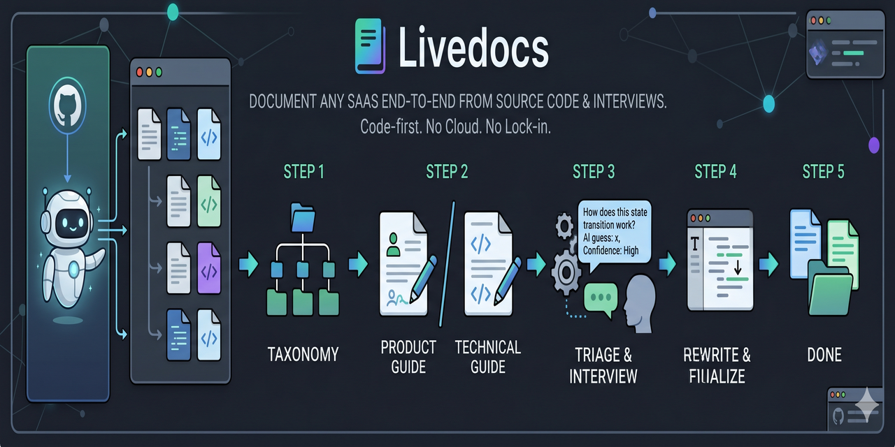

<div align="center">

# LiveDocs



[](https://www.gnu.org/licenses/agpl-3.0)
[]()

</div>

Document any SaaS, end-to-end, from its source code plus a guided
interview with the developer. The agent reads the repo, proposes a
taxonomy, drafts every article, then asks you only the questions the
code can't answer.

Two paired outputs per topic: a **product guide** (no jargon, for end
users) and a **technical guide** (with `file:line` references, for
devs). Both live inside the codebase. No cloud, no lock-in.

## How it works, in 5 steps

1. **Read the repo, propose a taxonomy.** Generates a semantic graph
   of the system, derives categories and articles. You approve.
   → [Phase 1 — Scan](skills/livedocs-bootstrap/references/phase-1-scan.md),
   [Phase 2 — Taxonomy](skills/livedocs-bootstrap/references/phase-2-taxonomy.md),
   [Phase 3 — Review](skills/livedocs-bootstrap/references/phase-3-review.md)

2. **Write every article in parallel, in two paired versions.**
   Product flavor (no jargon) and technical flavor (`file:line` refs).
   Marks where screenshots are needed. Logs every question the code
   alone can't resolve.
   → [Phase 4 — Drafts](skills/livedocs-bootstrap/references/phase-4-pass1-drafts.md),
   [Article format](skills/livedocs-bootstrap/references/article-format.md),
   [Screenshot TODOs](skills/livedocs-bootstrap/references/screenshot-todos.md),
   [Pending questions](skills/livedocs-bootstrap/references/pending-questions.md)

3. **Cross-link the articles, deduplicate the questions.** Resolves
   `[TODO:link=…]` placeholders, harmonizes terms, flags contradictions
   between guides.
   → [Phase 5 — Stitch](skills/livedocs-bootstrap/references/phase-5-pass2-stitching.md),
   [Phase 5.5 — Code-first triage](skills/livedocs-bootstrap/references/phase-5.5-triage.md) (re-checks
   every pending question against the code; only what truly needs a
   human reaches you)

4. **Interview you in chat**, with whatever survived the triage. Each
   question shows the agent's guess + confidence level. You confirm or
   correct, in thematic blocks (meaning / transitions / invariants /
   UX & support / code edges / direction).
   → [Phase 6 — Refinement](skills/livedocs-bootstrap/references/phase-6-refinement.md)

5. **Rewrite only the affected articles** from your answers.
   → [Phase 7 — Global update](skills/livedocs-bootstrap/references/phase-7-global-update.md)

Run real-world example: **76 articles + 6 journeys, ~$110 in LLM
spend, ~4 hours of human time** (mostly the interview). See the
[case study](docs/case-study.md) for the full per-phase breakdown.

---

## Install

Clone or fork this repo, then drop the skill folder where your agent
looks for skills:

### Claude Code

```bash
mkdir -p ~/.claude/skills
ln -s "$PWD/skills/livedocs-bootstrap" ~/.claude/skills/livedocs-bootstrap
```

### Hermes

```bash
mkdir -p ~/.hermes/skills
ln -s "$PWD/skills/livedocs-bootstrap" ~/.hermes/skills/livedocs-bootstrap
```

### Codex CLI / Copilot CLI / OpenCode / etc.

Each has its own skills directory — check that agent's docs. The
structure is generic: `SKILL.md` at the top, `references/*.md` next to
it. Any agent that can read SKILL.md frontmatter and load referenced
files works.

## Quickstart

In the chat with your agent, after the skill is installed:

```
I want to document this project. Use the livedocs-bootstrap skill.
```

The agent takes over and walks the 8 phases (0 → 5.5 → 7), pausing
for your consent between each. State persists in
`.livedocs/state.md`; you can interrupt and resume any time.

## Requirements

The skill itself is just markdown — no install needed beyond dropping
it into your agent's skills directory.

**External dependencies on the user's machine:**

- **A capable coding agent** with sub-agent / Task-like primitives,
  file write, and shell access. Verified: Claude Code (Sonnet 4 /
  Opus class), Hermes (Opus 4.7), Codex CLI. Smaller models drop
  output quality noticeably — Phase 4 drafts especially.

- **`graphify`** — strongly recommended. Without it Phase 1 still
  works (routes/i18n/models extractors give a usable signal), but
  the taxonomy proposal in Phase 2 is noticeably better when fed
  the semantic graph. Install:

  ```bash
  uv tool install graphifyy
  ```

  Project: [`safishamsi/graphify`](https://github.com/safishamsi/graphify).
  The skill detects whether `graphify` is on `$PATH` in Phase 1 and
  warns gracefully if not.

- **A git repo** — Phase 1 records the commit SHA at scan time;
  Phase 4 / 5 / 5.5 commit per batch (one-commit-per-capability is
  a non-negotiable core principle for recovery).

---

## What it is, technically

A skill — a folder of markdown files an agent reads and follows.
No binary, no Python runtime, nothing to install beyond dropping it
into your coding agent's skills directory (Claude Code, Codex CLI,
Cursor, Hermes, etc. — any agent with sub-agent / Task primitives,
file write, and shell access).

The output is a `docs/` directory with paired guides:

```
docs/
├── <capabilities-dir>/         # capabilities/ (en), capacidades/ (pt-BR), …
│   ├── <capability-slug>/
│   │   ├── <article-slug>.md           ← product flavor (end-user)
│   │   └── <article-slug>.tech.md      ← technical flavor (devs)
└── <journeys-dir>/             # journeys/ (en), jornadas/ (pt-BR), …
    ├── <journey-slug>.md
    └── <journey-slug>.tech.md
```

Plus state, pending questions, and screenshot TODOs in `.livedocs/`.

## What makes it different

- **Two flavors per topic**: same domain knowledge, two audiences — end
  users (product `.md`) and devs/AI (`.tech.md`). They never link to
  each other; cross-links go to other same-flavor guides.
- **Agent-driven**: the skill is the agent's read-only manual. No CLI,
  no separate Python process. State lives in plain markdown the user
  can read and edit.
- **Pending-question discipline**: questions about INTENT or
  EXPERIENCE (the only kind a human can answer) get batched for a
  single interview at the end. Questions about EXISTENCE or VALUE go
  back to the code where they belong.
- **Code-first triage (Phase 5.5)**: a dedicated pass re-checks every
  pending question against the codebase. The ones the agent can
  resolve with literal evidence get answered automatically AND the
  affected article gets patched, so the human only sees what genuinely
  needs them.
- **Single source of truth, one language per run**: language locked in
  Phase 0, used everywhere downstream. Translation is a separate
  downstream operation, not a runtime concern.

## Concepts

LiveDocs documents a SaaS through a small, opinionated vocabulary.
The choices below all came from one place: trying to keep the doc set
maintainable past ~20 articles, where naive approaches degrade fast.

### Capability, Journey, Screen — and what gets its own page

A **capability** is a business area as the user thinks of it
("Recurring billing", "Resident onboarding", "Dunning"). It's the
primary unit — typically 10–25 of them in a mid-sized SaaS, each
becomes a category in the help center.

A **journey** is a cross-cutting flow that touches several
capabilities to deliver an outcome ("From unit registered to first
paid invoice"). Secondary and optional — created only when explaining
the path end-to-end adds more than explaining capability-by-capability
would. Usually 5–15 per SaaS.

A **screen** is a UI route. Crucially, **screens are not first-class
documentation units** — they live as sections or screenshot anchors
inside the article of the capability they serve. The reason is
conceptual: knowledge belongs to a domain area, not to a button. A
screen is just where you go to act on that knowledge. Promoting
screens to standalone articles fragments the docs into
one-page-per-route, which scales badly and gives users a help center
that mirrors your nav rather than your domain.

(Exception: a screen so conceptually dense that its content doesn't
fit inside the parent capability gets its own page. Rare.)

### Why two flavors per topic

Every article is generated as a pair: `<slug>.md` (product) and
`<slug>.tech.md` (technical). Same domain knowledge, two audiences.

The product flavor uses the language the end user actually sees in the
UI — no column names, no enum values, no route paths in prose. The
technical flavor is the dev/AI counterpart, with `file:line` citations,
numbered invariants, code anchors. "Documentation" alone is ambiguous;
always qualify as "product guide" or "tech guide".

The two never link to each other. Cross-references go only to other
same-flavor guides. They describe the same thing for different
audiences; linking them creates a loop that adds no value and confuses
readers about which flavor they're in.

### Why pending questions instead of interrupting

When the agent is drafting an article and finds something the code
doesn't reveal (intent, UX rationale, integration behavior under
failure, the support team's most-asked questions), it does NOT pause and
interrupt the user. It registers a **pending question**, writes a
provisional answer into the draft labeled with a confidence flag, and
moves on.

Questions accumulate during Phase 4 and Phase 5. Phase 5.5 then
re-checks every question against the code (filtering out the
auto-answerable ones and patching articles that need fixing).
Whatever survives reaches Phase 6 — a single batch interview in
thematic blocks (meaning / transitions / invariants / UX-and-support /
code edges / meta-direction).

The separation is on purpose. The cost of context-switching the human
("answer this one thing right now") is much higher than the cost of
an extra phase that batches questions, and a batched interview ends
up tighter because the queue gets deduped first — one answer often
resolves several open questions.

### Why isolated context per draft

Phase 4 generates each article in **isolated context**. The sub-agent
sees: the guidance, a menu of other articles' titles (no bodies), the
article's own code anchors, and the style guide. Nothing else. No
global "all docs in prompt".

Two reasons. **Cost**: prompts that grow with N articles get
expensive fast — N² in the worst case. **Coherence**: an LLM's
attention degrades when it has to write coherently about *this*
article while keeping *all the others* in mind. Cross-linking
happens later in Phase 5, where the input is a short markdown index
of titles and summaries, not raw code.

### Why a guidance text exists

Some product knowledge isn't in the code. The reasoning behind a
decision, the customer profile, an upcoming pivot, an integration
quirk the maintainer keeps in their head — code captures behavior,
not intent. Phase 0 collects a free-form **guidance text** that gets
included in every later prompt as instruction, not as content to copy.

The complementary discipline is the **code capture point**: the git
commit SHA at scan time, persisted alongside the taxonomy. It pins
"this documentation was generated from this state of the code". The
SHA becomes important once incremental maintenance lands — diffing a
future PR against this SHA is how the skill will know which guides a
change affects.

## When to use it

- The user asks you to "document this project", "create a help
  center", "bootstrap docs", "generate documentation for this
  codebase", or similar.
- You're in a real SaaS / web app repo (Vue / React / Next / etc.)
  with code worth documenting.
- The codebase is large enough that hand-writing the help center
  would take weeks but small enough to fit in the agent's reading
  scope (sub-agents help here — see batch sizing in
  [`SKILL.md`](skills/livedocs-bootstrap/SKILL.md)).

## When NOT to use it

- The user wants to read existing docs → just open them.
- Single ad-hoc README → write it directly, no ceremony needed.
- Codebase is tiny (<10 files) → overkill.

## Cost expectations

Driven by the agent's LLM provider. Observed ranges across real runs:

- Phase 4 draft: **$0.30–$1.00 per article** (3× variance with
  capability size).
- Phase 5 stitch: **$0.50–$3.00 per capability**.
- Phase 5.5 triage: **$0.20–$1.50 per capability**.
- Phase 6 dedup + interview: **$0.50–$2 dedup, ~$0.05 per Q in chat**.
- Phase 7 rewrite: **$0.30–$0.80 per affected article**.

Real cost gets recorded in `.livedocs/state.md` as you go. Don't
promise users a fixed estimate — measure with your own project first.

The [case study](docs/case-study.md) (76 articles + 6 journeys, large
multi-tenant SaaS) landed around **~$110 in LLM spend, plus ~4 hours
of attended human time** (mostly the interview).

## Languages

The skill itself is in English (it's the agent's read-only manual).
The OUTPUT — chat messages, interview content, generated guides —
runs in whatever language Phase 0 locks in. Tested in pt-BR and en.
Adding new languages is a matter of letting Phase 0 detect/confirm
them — no skill changes needed.

See [`references/language-handling.md`](skills/livedocs-bootstrap/references/language-handling.md)
for the full rule.

## Privacy

The skill applies a hard denylist before sending any code to a
sub-agent: `.env*`, `secrets/`, `*.pem`/`*.key`, `.aws/`, `.ssh/`,
anything in `.gitignore`, anything in `.git/`. Phase 0 includes a
one-time heads-up that guidance text WILL appear in later LLM calls
so the user can self-redact before saving.

Full policy: [`references/privacy.md`](skills/livedocs-bootstrap/references/privacy.md).

## Repository layout

```
livedocs/
├── README.md                                 # this file
├── CLAUDE.md / AGENTS.md                     # dev guide for contributors
├── LICENSE                                   # AGPL-3.0-or-later
├── assets/
│   └── banner.png                            # social card image
├── docs/
│   └── case-study.md                         # real-run breakdown referenced from README
└── skills/
    └── livedocs-bootstrap/
        ├── SKILL.md                          # entry point, core principles
        ├── README.md                         # short pointer back to repo root
        ├── CHANGELOG.md                      # version history
        ├── fixtures/mini-saas/               # tiny Vue 3 fixture for smoke testing
        └── references/
            ├── language-handling.md          # i18n contract — READ FIRST
            ├── privacy.md                    # context boundaries
            ├── article-format.md             # markdown structure
            ├── state-format.md               # what .livedocs/state.md looks like
            ├── pending-questions.md          # heuristic for what NOT to ask
            ├── screenshot-todos.md           # admonition format + rules
            ├── phase-0-guidance.md
            ├── phase-1-scan.md
            ├── phase-2-taxonomy.md
            ├── phase-3-review.md
            ├── phase-4-pass1-drafts.md
            ├── phase-5-pass2-stitching.md
            ├── phase-5.5-triage.md
            ├── phase-6-refinement.md
            └── phase-7-global-update.md
```

`SKILL.md` is always loaded by the agent. Phase references load on
entry to each phase. Format references (language-handling, privacy,
article, state, pending, screenshot) load on demand from any phase.

## Customization

- **Style**: drop a `.livedocs/style.md` in the project to override
  the default voice ("conversational tutorial, second person, in
  `{lang}`, no jargon in product `.md`").
- **Language**: detected from i18n keys / comments / README in Phase
  0; user confirms or overrides with a BCP-47 code (`pt-BR`, `en`,
  `es-AR`, etc.).
- **Style + guidance + language all live in `.livedocs/`** — version
  them in your repo if you want runs to be reproducible.

## Known limitations

- **No publication** — generates local markdown only. Pushing to
  Chatwoot / other help centers is a follow-up skill, not yet built.
- **No incremental maintenance** — bootstrap is one-shot. Re-running
  the skill on the same project starts a new full run rather than
  diffing against the last one. Maintenance mode is planned.
- **Cost variability across LLMs** — the skill doesn't pin a model.
  Sonnet-class and Opus-class models produce noticeably better drafts
  than smaller ones; the skill's quality follows the agent's quality.
- **`is_intro` heuristic** — Phase 4 decides whether a capability
  needs an overview article. On small capabilities it sometimes still
  generates one; you can remove via Phase 3 before Phase 4 starts.

## Versioning

Each article carries a `skill_version` in its front-matter. When the
skill bumps, future maintenance can detect "this article was generated
by an older skill, conventions may have changed" and offer a re-pass.
See [`skills/livedocs-bootstrap/CHANGELOG.md`](skills/livedocs-bootstrap/CHANGELOG.md).

## Author

Built by **Tagôre Cardoso** — designed and dogfooded in
🇧🇷 **Brazil**, on a real production SaaS. The design choices that
look opinionated here came from things going wrong in attended runs,
not from whiteboarding. If a rule in `skills/livedocs-bootstrap/references/`
reads like it was written after an incident, it usually was.

Find Tagôre on [LinkedIn](https://www.linkedin.com/in/tagorecaue/)
or [GitHub](https://github.com/tagorecaue).

Open to feedback, bug reports, and reproduction repos. Not open to
external PRs yet — the skill is in validation through dogfooding.

## Contributing

See [`CLAUDE.md`](CLAUDE.md) for the dev guide (applies to any agent
or human contributor working on the skill itself).

## License

AGPL-3.0-or-later. Forks must open. See [`LICENSE`](LICENSE).

---

<sub>Made in 🇧🇷 Brazil by [Tagôre Cardoso](https://www.linkedin.com/in/tagorecaue/) · [GitHub](https://github.com/tagorecaue)</sub>
