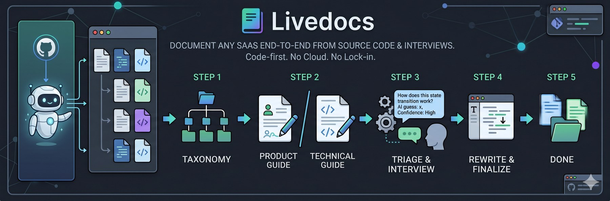

<div align="center">



</div>

<p align="center">
  🇺🇸 <a href="../../README.md">English</a> | 🇧🇷 <a href="README.pt-BR.md">Português</a>
</p>

<p align="center">
  <a href="https://www.gnu.org/licenses/agpl-3.0"></a>
  <a href="#"></a>
  <a href="https://github.com/safishamsi/graphify"></a>
  <a href="https://www.linkedin.com/in/tagorecaue/"></a>
  <a href="https://github.com/tagorecaue"></a>
</p>

# LiveDocs
Documente qualquer SaaS, do começo ao fim, a partir do código-fonte
e de uma entrevista guiada com a pessoa que mantém o produto. O
agente lê o repo, propõe uma taxonomia, escreve cada artigo, e só
te pergunta o que o código não consegue responder.

Duas saídas pareadas por tópico: um **guia de produto** (sem jargão,
para o usuário final) e um **guia técnico** (com referências
`arquivo:linha`, para devs). Os dois ficam dentro do próprio
repositório. Sem nuvem obrigatória, sem lock-in.

## Como funciona, em 5 passos

1. **Lê o repo, propõe uma taxonomia.** Constrói um grafo semântico
   do código (usando o
   [graphify](https://github.com/safishamsi/graphify) — a
   ferramenta open source MIT do Safi Shamsi para gerar grafos de
   conhecimento), deriva categorias e artigos. Você aprova.
   → [Phase 1](../../skills/livedocs-bootstrap/references/phase-1-scan.md),
   [2](../../skills/livedocs-bootstrap/references/phase-2-taxonomy.md),
   [3](../../skills/livedocs-bootstrap/references/phase-3-review.md)

2. **Escreve cada artigo em paralelo, em duas versões pareadas.**
   Versão de produto (sem jargão) + versão técnica (com refs
   `arquivo:linha`). Marca onde precisa de screenshot. Registra cada
   pergunta que o código sozinho não resolve.
   → [Phase 4](../../skills/livedocs-bootstrap/references/phase-4-pass1-drafts.md)

3. **Faz cross-link entre artigos, deduplica e roda triagem
   code-first** em cada pergunta pendente. Só o que realmente precisa
   de humano chega até você.
   → [Phase 5](../../skills/livedocs-bootstrap/references/phase-5-pass2-stitching.md),
   [5.5](../../skills/livedocs-bootstrap/references/phase-5.5-triage.md)

4. **Entrevista você no chat** com o que sobreviveu da triagem,
   agrupado por tema (significado / transições / invariantes /
   UX-suporte / bordas de código / direção). Cada pergunta mostra
   o palpite do agente + nível de confiança.
   → [Phase 6](../../skills/livedocs-bootstrap/references/phase-6-refinement.md)

5. **Reescreve apenas os artigos afetados** pelas suas respostas.
   → [Phase 7](../../skills/livedocs-bootstrap/references/phase-7-global-update.md)

Run real: 76 artigos + 6 jornadas, ~US$ 110 em gasto de LLM,
~4h de tempo humano. Detalhamento completo no
[case study](case-study.pt-BR.md).

## Instalação

```bash
npx skills@latest add tagorecaue/livedocs
```

O instalador pergunta em qual(is) agente(s) de código instalar
(Claude Code, Codex, Cursor, OpenCode, etc.) e cria symlinks da
skill em cada um.

Depois, dentro do seu agente, rode o setup único de ambiente:

```
/setup-livedocs
```

Ele verifica se o `graphify` está instalado e instala se faltar
(via `uv` ou `pipx`).

<details>
<summary>Instalação manual (sem npm)</summary>

Clone ou faça fork do repo, depois symlinka a pasta da skill para
o diretório do seu agente:

```bash
# Claude Code
ln -s "$PWD/skills/livedocs-bootstrap" ~/.claude/skills/livedocs-bootstrap

# Hermes
ln -s "$PWD/skills/livedocs-bootstrap" ~/.hermes/skills/livedocs-bootstrap
```

E instale o `graphify` manualmente:

```bash
uv tool install graphifyy
```

</details>

## Quickstart

No chat com o seu agente:

```
Use a skill livedocs-bootstrap para documentar este projeto.
```

O agente assume daí. O estado persiste em `.livedocs/state.md` —
você pode interromper e retomar a qualquer momento.

## Pré-requisitos

- Um agente de código com primitivas de sub-agente / Task,
  permissão de escrita em arquivos, e shell. Verificado:
  Claude Code (Sonnet 4 / Opus), Hermes (Opus 4.7), Codex CLI.
  Modelos menores derrubam visivelmente a qualidade da Phase 4.
- [`graphify`](https://github.com/safishamsi/graphify) — instalado
  automaticamente pelo `/setup-livedocs`. Sem ele, a taxonomia
  da Phase 2 fica mais fraca, mas o resto continua funcionando.
- Um repositório git (Phase 1 grava o SHA do scan; as fases
  posteriores fazem commit-por-batch).
- `node` / `npx` se você usar a instalação de uma linha acima.
  Pula se for instalação manual.

## Quando usar / quando NÃO usar

Use quando o usuário pede documentação, help center, docs de
onboarding, etc., E o codebase é grande o bastante para que escrever
manualmente levaria semanas. Pula quando já existe doc para ler,
quando um README único basta, ou quando o repo é pequeno.

## Para se aprofundar

- [**Conceitos**](concepts.pt-BR.md) — Por que capability/journey/screen,
  por que dois flavors, por que pending questions, por que contexto
  isolado, qual é o papel do guidance text.
- [**Notas operacionais**](operating-notes.pt-BR.md) — Formato de saída,
  faixas de custo, idiomas, privacidade, customização, limitações
  conhecidas.
- [**Case study**](case-study.pt-BR.md) — Detalhamento por fase de
  um run em produção real.
- [`SKILL.md`](../../skills/livedocs-bootstrap/SKILL.md) — O manual
  do agente: 13 princípios core, tabela de fases, batch sizing.
- [`CHANGELOG.md`](../../skills/livedocs-bootstrap/CHANGELOG.md) —
  Histórico de versões.

## Autor

Feito por **Tagôre Cardoso** — projetado e dogfoodado no
🇧🇷 **Brasil**, em um SaaS de produção real. As decisões de design
que parecem opinativas vieram de coisas dando errado em runs
acompanhados, não de whiteboarding.

Tagôre no [LinkedIn](https://www.linkedin.com/in/tagorecaue/) e no
[GitHub](https://github.com/tagorecaue). Feedback, bug reports e
repositórios de reprodução são bem-vindos.

## Licença

AGPL-3.0-or-later. Forks devem ser abertos. Veja
[`LICENSE`](../../LICENSE).

Para diretrizes de desenvolvimento, veja [`CLAUDE.md`](../../CLAUDE.md).

---

<sub>Feito no 🇧🇷 Brasil por [Tagôre Cardoso](https://www.linkedin.com/in/tagorecaue/) · [GitHub](https://github.com/tagorecaue)</sub>
